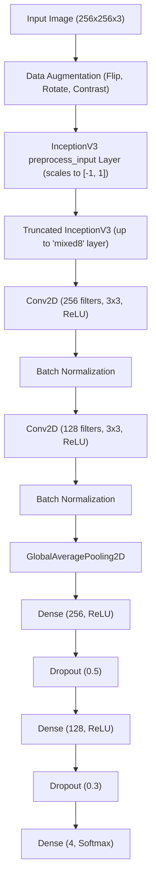
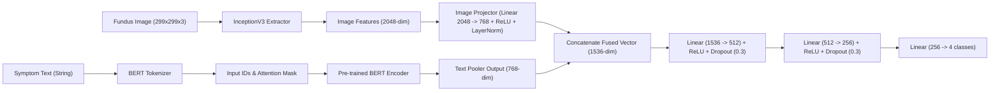
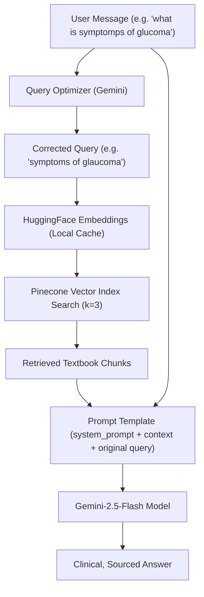

# OcuCare Ophthalmic AI Architecture & Inference Description

This document describes the detailed architecture and inner workings of the multi-modal eye disease classification models and chatbot pipeline implemented in the **OcuCare** platform.

---

## 1. System Overview

OcuCare features a hybrid diagnostic intelligence system comprising:
1. **Vision CNN Model (`my_model.keras`):** An image-only deep learning model built using Keras/TensorFlow.
2. **Multi-Modal Fusion Model (`fusion_classifier.pth`):** A PyTorch classifier combining fundus image features (InceptionV3) and patient symptom descriptions (BERT).
3. **RAG Chatbot Pipeline (OcuAI):** A LangChain-driven conversational agent connected to a Pinecone vector database populated with literature from *Kanski's Clinical Ophthalmology* textbook, falling back to a query-optimized Gemini LLM.

---

## 2. Vision CNN Architecture (Keras/TensorFlow)

The Vision CNN classifier analyzes fundus eye images to classify them into 4 distinct categories:
* `Cataract` (Index 0)
* `Diabetic Retinopathy` (Index 1)
* `Glaucoma` (Index 2)
* `Normal` (Index 3)

### Layer-by-Layer Architecture

### Preprocessing & Data Flow
1. **Input:** Expects raw image pixel arrays in `[0, 255]` range, resized to $256 \times 256 \times 3$.
2. **Internal Scaling:** The model features an internal `preprocess_input` layer. It divides input pixels by `127.5` and subtracts `1.0` to normalize them into `[-1, 1]` automatically. 
3. **Feature Extraction:** A truncated `InceptionV3` base extracts high-level spatial visual features.
4. **Classification:** Dense layers output probability scores using a `Softmax` activation.

---

## 3. Multi-Modal Fusion Classifier (PyTorch)

The Fusion model performs classification by simultaneously analyzing a **fundus image** and a **textual symptom description** provided by the patient.

### Architecture Diagram

### How Fusion Works
1. **Text Encoding:** Patient symptoms are tokenized and processed by a pre-trained `bert-base-uncased` transformer, outputting a $768$-dimensional pooler representation.
2. **Image Feature Extraction:** The fundus image is processed through a full `InceptionV3` feature extractor, outputting a $2048$-dimensional feature vector.
3. **Projection & Alignment:** A projection layer maps the $2048$ image features down to $768$ to align them symmetrically with the text features.
4. **Concatenation:** The $768$-dim text and $768$-dim projected image vectors are concatenated into a single $1536$-dimensional representation.
5. **Combined Feedforward:** Fully connected layers process this combined vector to output raw logits for the 4 classes.

---

## 4. OcuAI Chatbot & RAG Pipeline (LangChain)

The chatbot uses Retrieval-Augmented Generation (RAG) to ground LLM answers in clinical textbook knowledge, preventing medical hallucinations.

### Key Components
1. **Query Optimizer Chain:** Typographical errors (like `"glucoma"` or `"symptomps"`) degrade vector similarity matching. We use a lightweight Gemini chain to auto-correct and optimize queries before searching.
2. **Vector DB (Pinecone):** Stores embeddings of the clinical ophthalmic textbook chunks.
3. **Strict Source Transparency:** If Pinecone returns relevant documents, OcuAI outputs a structured answer beginning with `✅ Source: OcuCare Knowledge Base`.
4. **Adaptive Offline Fallback:** If the Pinecone API cannot be reached (due to local network/DNS resolution issues), OcuAI detects the network error, falls back to `offline_system_prompt`, and generates an answer using Gemini's general clinical knowledge, clearly labeled as `⚠️ Source: Not found in Knowledge Base (Response generated from OcuAI general knowledge)`.

---

## 5. Summary of Preprocessing Rules
To prevent prediction collapse (e.g., predicting the same class continuously), the following preprocessing rules must be followed:

| Model | Input Type | Preprocessing | Output Activation |
| :--- | :--- | :--- | :--- |
| **Vision CNN** | Fundus Image | Resize to `(256, 256)`, convert to Float32, keep range `[0, 255]`. Do **not** divide by 255. | Softmax (4 classes) |
| **Fusion (Image)** | Fundus Image | Resize to `(299, 299)`, run `inception_v3.preprocess_input` (scales to `[-1, 1]`). | Raw Logits (4 classes) |
| **Fusion (Text)** | Symptom String | Tokenize via `BertTokenizer` (max length 50). | Raw Logits (4 classes) |
